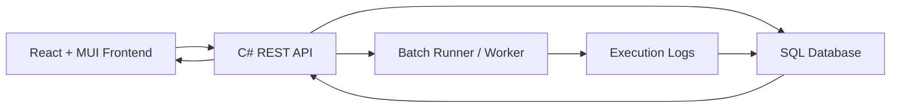
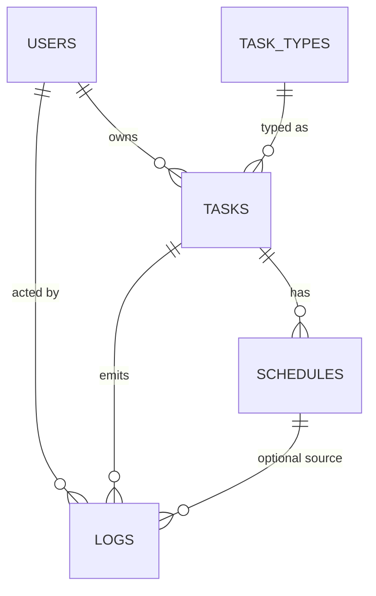

# Spectrum Full-Stack Architecture, Integration, and DB Schema

This document is a deep technical reference for:
- frontend architecture
- backend architecture (contract-aligned)
- frontend-backend integration details
- database schema (proposed and contract-aligned)
- operational and testing guidance

## 1. Scope and Assumptions

- Frontend codebase: `/Users/kirthick21/Desktop/Sprint-Frontend`
- Backend source code is not in this repository.
- Backend sections here are based on the confirmed API contract and frontend integration behavior.
- Where backend implementation details are not explicitly available, this document marks them as `Recommended`.

## 2. System Overview

## 2.1 Business Goal

Spectrum is a self-service scheduling platform to:
- define task types and batch execution paths
- create tasks and schedules (including cron)
- monitor status and next/previous runs
- run tasks on demand
- view centralized audit logs
- manage users and role-based access

## 2.2 Role Model

User authorization model is based on `userLevel`:
- `0` = Viewer
- `1` = Editor
- `2` = Admin

Frontend role mapping:
- `0 -> VIEWER`
- `1 -> EDITOR`
- `2 -> ADMIN`

## 2.3 High-Level Architecture



## 3. Frontend Architecture (Current Implementation)

## 3.1 Tech Stack

- React 19
- TypeScript
- Vite
- React Router
- MUI 7

## 3.2 Entry and Providers

- Entry point: `/Users/kirthick21/Desktop/Sprint-Frontend/src/main.tsx`
- Provider order:
- `ThemeProvider`
- `CssBaseline`
- `AuthProvider`
- `SnackbarProvider`
- `RouterProvider`

## 3.3 Folder Responsibility

- `src/app`
- app-level contexts (`AuthContext`, `SnackbarContext`)
- route tree and guards (`router.tsx`)
- theme (`theme.ts`)
- `src/features/api`
- shared HTTP client and error normalization
- `src/features/tasks`
- tasks and schedules API wrappers, forms, table views, hooks, schedule utilities
- `src/features/logs`
- audit APIs and compact expandable audit table
- `src/pages`
- route-level page components
- `src/components/common`
- reusable UI primitives used across pages

## 3.4 Frontend Route Map

Public:
- `/login`
- `/create-password`

User app routes (`EDITOR`, `VIEWER`):
- `/app/dashboard`
- `/app/tasks`
- `/app/tasks/:taskId`
- `/app/create-task` (viewers blocked at page level)
- `/app/logs` (UI label is `Audit`)

Admin routes (`ADMIN`):
- `/admin/overview`
- `/admin/tasks`
- `/admin/tasks/:taskId`
- `/admin/create-task`
- `/admin/task-types`
- `/admin/users`
- `/admin/logs` (UI label is `Audit`)

## 3.5 State Management Pattern

The app intentionally uses simple state patterns:
- local page state for forms, filters, selected items, loading flags
- context only for cross-cutting concerns:
- auth identity
- toast notifications
- API service layer for data access and mapping

No Redux/RTK or React Query is currently used.

## 3.6 Shared UI Components

- `PageHeader`: page titles + actions
- `DataTable`: reusable tabular wrapper
- `StatusChip`: uniform status rendering
- `ConfirmDialog`: destructive-action confirmation modal
- `EmptyState`: no-data state
- `ErrorState`: reusable retryable error state

## 3.7 Theme and UX Standards

Theme file: `/Users/kirthick21/Desktop/Sprint-Frontend/src/app/theme.ts`

Key standards:
- dark, high-contrast dashboard palette
- consistent card surfaces and shadows
- button polish:
- non-uppercase text
- consistent radius
- better hover behavior
- compact table headers and clear typography hierarchy

## 3.8 Frontend Domain Model

File: `/Users/kirthick21/Desktop/Sprint-Frontend/src/types/domain.ts`

Core types:
- `Task`
- `Schedule`
- `LogEntry`
- `User`
- `TaskTypeDefinition`

Notes:
- IDs are numeric (`number`) in frontend.
- Email list is represented as `string[]` in UI and converted to CSV for backend.

## 3.9 Feature Behavior Summary

Tasks:
- create, edit, delete
- add/edit/delete schedule
- pause/resume schedules from task list context
- run task now from list and details page

Audit:
- renamed from "Logs" in UI labels
- compact table view
- default columns:
- timestamp
- user email
- task name
- row expand for action/details

Users:
- admin can create user with name/email/role
- password is no longer set in admin form
- first-time user sets password on dedicated page

## 4. Backend Architecture (Contract-Aligned)

The following structure is recommended and aligns with current API behavior.

## 4.1 Layered Design

- Presentation layer:
- REST controllers
- Application layer:
- use-case services (task scheduling, user mgmt, task run orchestration)
- Domain layer:
- entities, status transitions, business rules
- Infrastructure layer:
- repositories, DB context, batch execution adapter, logging

## 4.2 Suggested Backend Modules

- `AuthController` / `AuthService`
- `UsersController` / `UsersService`
- `TaskTypesController` / `TaskTypesService`
- `TasksController` / `TasksService`
- `SchedulesController` (or nested under tasks)
- `LogsController`
- `ExecutionService` for batch process invocation

## 4.3 Status Enums (Contract)

Task status:
- `Active`
- `Not Scheduled`
- `Deleted`
- `Error`

Schedule status:
- `Active`
- `Paused`
- `Deleted`

## 4.4 Core Business Rules

- Deleting a task is soft delete (`Status = Deleted`).
- Deleting a schedule is soft delete (`Status = Deleted`).
- Task type title update may fail if referenced by tasks.
- Task type delete may fail if referenced by tasks.
- Owner/user identity is immutable for task update.
- Task run endpoint executes the task type batch path and logs output snippet.

## 5. API Contract Reference (Integrated Endpoints)

## 5.1 Auth

- `POST /auth/login`
- request: `{ email, password }`
- response: `{ id, name, email, isAdmin?, userLevel }` (frontend uses `userLevel`)
- `POST /auth/create-password` (configurable path from frontend env)
- request: `{ email, password }`
- response: `204` or `200` depending implementation

## 5.2 Users

- `POST /users`
- request: `{ name, email, userLevel }`
- `GET /users`
- `DELETE /users/{id}`

## 5.3 Task Types

- `POST /tasktypes`
- request: `{ title, batchPath }`
- `GET /tasktypes`
- `PATCH /tasktypes/{id}/batchpath`
- `PATCH /tasktypes/{id}/title`
- `DELETE /tasktypes/{id}`

## 5.4 Tasks

- `POST /tasks`
- `GET /tasks`
- `GET /tasks/{taskId}`
- `PUT /tasks/{taskId}`
- `PATCH /tasks/{taskId}/status`
- `DELETE /tasks/{taskId}`
- `GET /tasks/search?q=&typeId=&status=`
- `POST /tasks/{taskId}/run`

## 5.5 Schedules

- `GET /tasks/{taskId}/schedules`
- `POST /tasks/{taskId}/schedules`
- `PUT /tasks/{taskId}/schedules/{scheduleId}`
- `PATCH /tasks/{taskId}/schedules/{scheduleId}/status`
- `DELETE /tasks/{taskId}/schedules/{scheduleId}`

## 5.6 Logs/Audit

- `GET /logs/all`
- `GET /logs?taskId=&startTimestamp=&endTimestamp=`

## 6. Frontend-Backend Integration Details

## 6.1 API Client

Shared client: `/Users/kirthick21/Desktop/Sprint-Frontend/src/features/api/httpClient.ts`

Responsibilities:
- base URL concatenation
- typed JSON request/response handling
- 204 no-content support
- network failure handling
- normalized user-friendly error messages
- context-aware conflict messaging

## 6.2 Data Mapping Layer

Task adapter: `/Users/kirthick21/Desktop/Sprint-Frontend/src/features/tasks/api/tasksApi.ts`

Examples:
- backend `emailList` CSV <-> frontend `accessEmails[]`
- backend `taskTypeId` -> frontend `type` title via task types lookup
- backend `ownerId` -> frontend `createdBy` email/name via users lookup
- backend schedule `{ windowStart, cronExpression }` -> frontend schedule view model

Audit adapter: `/Users/kirthick21/Desktop/Sprint-Frontend/src/features/logs/api/logsApi.ts`

Examples:
- backend `{ action, body }` -> frontend `LogEntry`
- local filter for search in action/body

## 6.3 Auth and Session Integration

- `AuthContext` persists `id`, `username`, `role` in localStorage.
- No token flow implemented yet.
- Login page detects password-setup-required errors and redirects to create-password page.

## 6.4 Error Contract Handling

Handled payload shapes:
- `detail`
- `title`
- `message`
- `errors` validation dictionary

Status-specific UX examples:
- login 401 -> incorrect credentials
- user delete conflict -> protected admin cannot be removed
- type-in-use conflict -> clearer business conflict message
- create-password endpoint missing -> explicit message

## 7. Database Schema (Proposed, Contract-Aligned)

This schema is designed to support current APIs and UI behavior.

## 7.1 Entity Relationship



## 7.2 Tables and Columns

### `users`

- `id` INT PK IDENTITY
- `name` NVARCHAR(150) NOT NULL
- `email` NVARCHAR(320) NOT NULL UNIQUE
- `password_hash` NVARCHAR(512) NULL
- `user_level` TINYINT NOT NULL CHECK (`0,1,2`)
- `is_active` BIT NOT NULL DEFAULT 1
- `created_at` DATETIME2 NOT NULL DEFAULT SYSUTCDATETIME()
- `updated_at` DATETIME2 NOT NULL DEFAULT SYSUTCDATETIME()

### `task_types`

- `id` INT PK IDENTITY
- `title` NVARCHAR(100) NOT NULL UNIQUE
- `batch_path` NVARCHAR(500) NOT NULL
- `created_at` DATETIME2 NOT NULL DEFAULT SYSUTCDATETIME()
- `updated_at` DATETIME2 NOT NULL DEFAULT SYSUTCDATETIME()

### `tasks`

- `id` INT PK IDENTITY
- `task_type_id` INT NOT NULL FK -> `task_types(id)`
- `name` NVARCHAR(200) NOT NULL
- `description` NVARCHAR(1000) NULL
- `owner_id` INT NOT NULL FK -> `users(id)`
- `email_list` NVARCHAR(MAX) NULL
- `status` NVARCHAR(30) NOT NULL
- `prev_run` DATETIME2 NULL
- `next_run` DATETIME2 NULL
- `created_at` DATETIME2 NOT NULL DEFAULT SYSUTCDATETIME()
- `updated_at` DATETIME2 NOT NULL DEFAULT SYSUTCDATETIME()

### `schedules`

- `id` INT PK IDENTITY
- `task_id` INT NOT NULL FK -> `tasks(id)`
- `window_start` DATETIME2 NOT NULL
- `window_end` DATETIME2 NULL
- `cron_expression` NVARCHAR(120) NOT NULL
- `status` NVARCHAR(30) NOT NULL
- `created_at` DATETIME2 NOT NULL DEFAULT SYSUTCDATETIME()
- `updated_at` DATETIME2 NOT NULL DEFAULT SYSUTCDATETIME()

### `logs`

- `id` BIGINT PK IDENTITY
- `user_id` INT NULL FK -> `users(id)`
- `task_id` INT NOT NULL FK -> `tasks(id)`
- `schedule_id` INT NULL FK -> `schedules(id)`
- `timestamp` DATETIME2 NOT NULL DEFAULT SYSUTCDATETIME()
- `action` NVARCHAR(100) NOT NULL
- `body` NVARCHAR(MAX) NULL

## 7.3 Suggested Indexes

- `IX_users_email` unique on `users(email)`
- `IX_tasks_owner_status` on `tasks(owner_id, status)`
- `IX_tasks_type_status` on `tasks(task_type_id, status)`
- `IX_tasks_name` on `tasks(name)` for search
- `IX_schedules_task_status` on `schedules(task_id, status)`
- `IX_logs_task_timestamp` on `logs(task_id, timestamp DESC)`
- `IX_logs_timestamp` on `logs(timestamp DESC)`
- `IX_logs_user_timestamp` on `logs(user_id, timestamp DESC)`

## 7.4 Suggested Constraints

- Task status CHECK: `Active`, `Not Scheduled`, `Deleted`, `Error`
- Schedule status CHECK: `Active`, `Paused`, `Deleted`
- User level CHECK: `0`, `1`, `2`
- Optional FK delete behavior:
- avoid cascading hard deletes if using soft-delete model

## 7.5 SQL DDL (Reference)

```sql
CREATE TABLE users (
  id INT IDENTITY(1,1) PRIMARY KEY,
  name NVARCHAR(150) NOT NULL,
  email NVARCHAR(320) NOT NULL UNIQUE,
  password_hash NVARCHAR(512) NULL,
  user_level TINYINT NOT NULL CHECK (user_level IN (0,1,2)),
  is_active BIT NOT NULL DEFAULT 1,
  created_at DATETIME2 NOT NULL DEFAULT SYSUTCDATETIME(),
  updated_at DATETIME2 NOT NULL DEFAULT SYSUTCDATETIME()
);

CREATE TABLE task_types (
  id INT IDENTITY(1,1) PRIMARY KEY,
  title NVARCHAR(100) NOT NULL UNIQUE,
  batch_path NVARCHAR(500) NOT NULL,
  created_at DATETIME2 NOT NULL DEFAULT SYSUTCDATETIME(),
  updated_at DATETIME2 NOT NULL DEFAULT SYSUTCDATETIME()
);

CREATE TABLE tasks (
  id INT IDENTITY(1,1) PRIMARY KEY,
  task_type_id INT NOT NULL,
  name NVARCHAR(200) NOT NULL,
  description NVARCHAR(1000) NULL,
  owner_id INT NOT NULL,
  email_list NVARCHAR(MAX) NULL,
  status NVARCHAR(30) NOT NULL CHECK (status IN ('Active','Not Scheduled','Deleted','Error')),
  prev_run DATETIME2 NULL,
  next_run DATETIME2 NULL,
  created_at DATETIME2 NOT NULL DEFAULT SYSUTCDATETIME(),
  updated_at DATETIME2 NOT NULL DEFAULT SYSUTCDATETIME(),
  CONSTRAINT FK_tasks_task_types FOREIGN KEY (task_type_id) REFERENCES task_types(id),
  CONSTRAINT FK_tasks_users FOREIGN KEY (owner_id) REFERENCES users(id)
);

CREATE TABLE schedules (
  id INT IDENTITY(1,1) PRIMARY KEY,
  task_id INT NOT NULL,
  window_start DATETIME2 NOT NULL,
  window_end DATETIME2 NULL,
  cron_expression NVARCHAR(120) NOT NULL,
  status NVARCHAR(30) NOT NULL CHECK (status IN ('Active','Paused','Deleted')),
  created_at DATETIME2 NOT NULL DEFAULT SYSUTCDATETIME(),
  updated_at DATETIME2 NOT NULL DEFAULT SYSUTCDATETIME(),
  CONSTRAINT FK_schedules_tasks FOREIGN KEY (task_id) REFERENCES tasks(id)
);

CREATE TABLE logs (
  id BIGINT IDENTITY(1,1) PRIMARY KEY,
  user_id INT NULL,
  task_id INT NOT NULL,
  schedule_id INT NULL,
  [timestamp] DATETIME2 NOT NULL DEFAULT SYSUTCDATETIME(),
  [action] NVARCHAR(100) NOT NULL,
  body NVARCHAR(MAX) NULL,
  CONSTRAINT FK_logs_users FOREIGN KEY (user_id) REFERENCES users(id),
  CONSTRAINT FK_logs_tasks FOREIGN KEY (task_id) REFERENCES tasks(id),
  CONSTRAINT FK_logs_schedules FOREIGN KEY (schedule_id) REFERENCES schedules(id)
);

CREATE INDEX IX_tasks_owner_status ON tasks(owner_id, status);
CREATE INDEX IX_tasks_type_status ON tasks(task_type_id, status);
CREATE INDEX IX_tasks_name ON tasks(name);
CREATE INDEX IX_schedules_task_status ON schedules(task_id, status);
CREATE INDEX IX_logs_task_timestamp ON logs(task_id, [timestamp] DESC);
CREATE INDEX IX_logs_timestamp ON logs([timestamp] DESC);
```

## 8. End-to-End Flow Examples

## 8.1 Create User -> First Login -> Create Password

1. Admin creates user (`name`, `email`, `userLevel`) from `/admin/users`.
2. User attempts login at `/login`.
3. Backend indicates password not set (contract-specific response/error).
4. Frontend redirects to `/create-password?email=<email>`.
5. User sets password.
6. User logs in successfully.

## 8.2 Create Task with Optional Schedule

1. User/admin opens create task page.
2. Frontend resolves task type title to `taskTypeId`.
3. Frontend resolves `createdBy` email/name to `ownerId`.
4. Frontend posts `/tasks`.
5. If schedule included, payload embeds `windowStart`, `windowEnd`, `cronExpression`.
6. After create, frontend loads full task details from `/tasks/{id}` + schedules.

## 8.3 Pause/Resume from Task List

1. User clicks pause/resume in 3-dot menu.
2. Frontend inspects task schedules.
3. If none: toast `Not Scheduled`.
4. Else updates each relevant schedule via `/tasks/{taskId}/schedules/{scheduleId}/status`.
5. Refreshes task list and recomputes next/previous run display.

## 8.4 Run Task On Demand

1. User clicks `Run Now`.
2. Frontend calls `POST /tasks/{taskId}/run`.
3. Backend executes `taskType.batchPath`.
4. Backend writes log record and updates task run fields/status.
5. Frontend reloads list/details and audit.

## 9. Security and Compliance Recommendations

Recommended backend improvements:
- store password hashes using strong algorithm (`Argon2` or `PBKDF2` with per-user salt)
- enforce password policy server-side
- add JWT or session tokens (frontend currently identity-only)
- implement authz policies per endpoint by `userLevel`
- sanitize/validate `batch_path` to avoid command injection
- rate-limit login endpoints
- audit security-sensitive actions (user create/delete, task type edits, run invocations)

## 10. Performance Recommendations

Frontend:
- server-side pagination for `/logs/all` and `/tasks`
- debounce search inputs
- consider React Query for cache + stale refresh

Backend:
- pagination and filtering at DB layer
- add covering indexes for common search/sort paths
- background worker queue for task execution if execution latency increases

## 11. Testing Strategy

Frontend:
- unit tests for mapping helpers (`tasksApi` adapters)
- component tests for forms and route guards
- e2e tests:
- login flow
- create password flow
- task create/update/delete
- run now
- audit filtering and expand rows

Backend:
- controller integration tests for all endpoints
- service tests for status transitions and conflict rules
- migration tests for DB schema compatibility

## 12. Deployment and Environment Strategy

Recommended:
- separate envs: `dev`, `qa`, `prod`
- frontend env per environment:
- `VITE_API_BASE_URL`
- `VITE_CREATE_PASSWORD_PATH` (if non-default)
- enable CORS only for known frontend origins
- add health checks for API and DB

## 13. Traceability: Key Files

Frontend key files:
- `/Users/kirthick21/Desktop/Sprint-Frontend/src/main.tsx`
- `/Users/kirthick21/Desktop/Sprint-Frontend/src/app/router.tsx`
- `/Users/kirthick21/Desktop/Sprint-Frontend/src/app/AuthContext.tsx`
- `/Users/kirthick21/Desktop/Sprint-Frontend/src/features/api/httpClient.ts`
- `/Users/kirthick21/Desktop/Sprint-Frontend/src/features/tasks/api/tasksApi.ts`
- `/Users/kirthick21/Desktop/Sprint-Frontend/src/features/logs/api/logsApi.ts`
- `/Users/kirthick21/Desktop/Sprint-Frontend/src/pages/admin/AdminUsersPage.tsx`
- `/Users/kirthick21/Desktop/Sprint-Frontend/src/pages/CreatePasswordPage.tsx`

---

If you share backend source or actual EF Core models/migrations, this document can be converted from contract-aligned to exact implementation documentation.
